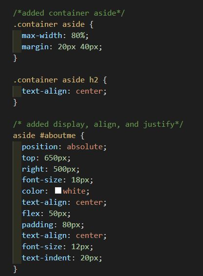
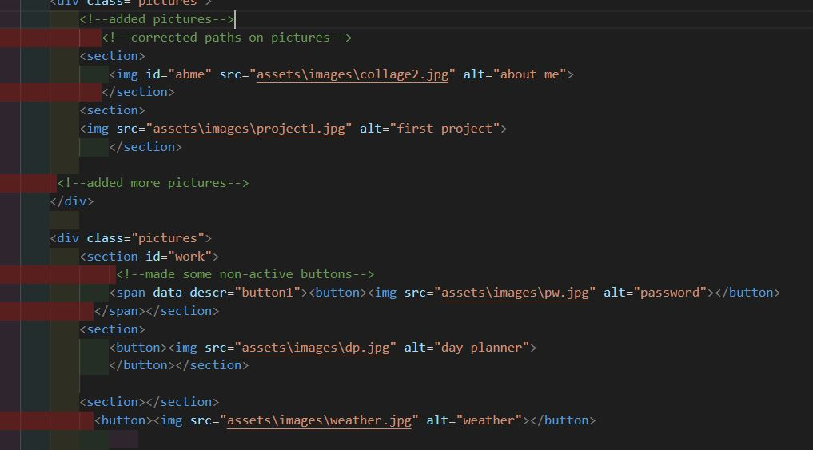
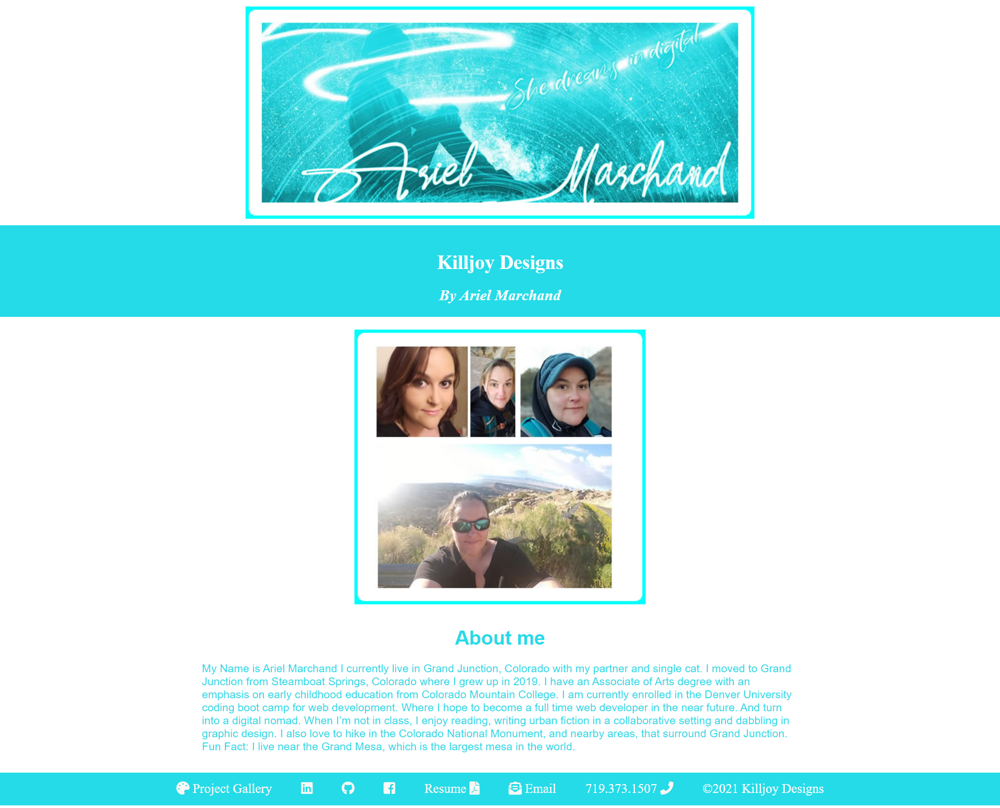
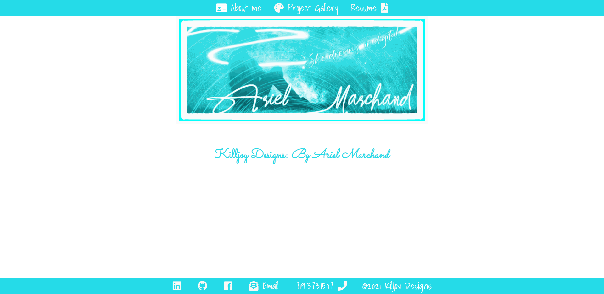
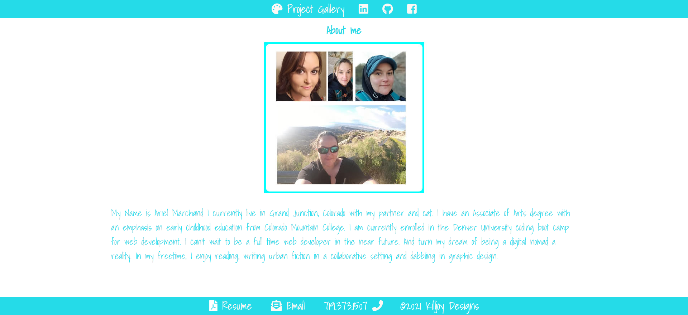
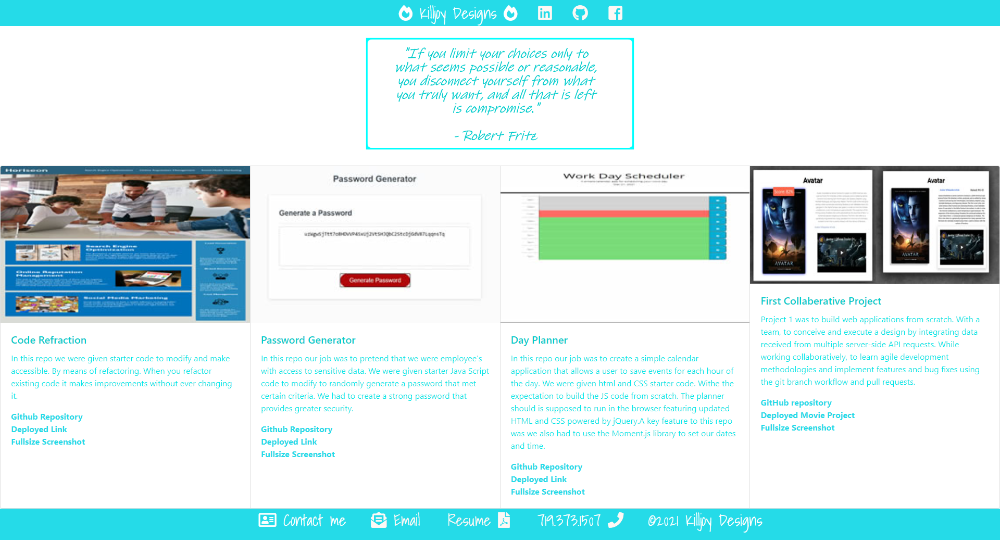

# 02-Advanced-CSS-Portfolio # My First portfolio
## Introduction:

In this activity I've made a 3rd and final update to my  portfolio that I had started from scratch to showcase my  working skills and talents. For any potential employers that come across my portfolio looking to fill a position. I have provided the following information to my portfolio: The developer's name, a recent photo, and links to sections about myself and my work, and how to contact myself.

You can view my portfolio by following this link:

[Killjoy Designs: Personal Portfolio update #3](https://killjoyangel.github.io/Updated-Portfolio-Page-2/index.html)

Attempted to make lots of commits and pushed to github. 

## Technologies used:
* HTML
* CSS
* Bootstrap
 
 

### Screen shots of wireframe, html and CSS
Also took plenty of notes of my changes in both the html and CSS
 
 

### Original CSS

 
  

### Original HTML

 
 

# The evolution of my portfolio

### Original Portfolio fullpage screenshot

### first update  Portfolio full page screenshot

### Final update to current portfolio

