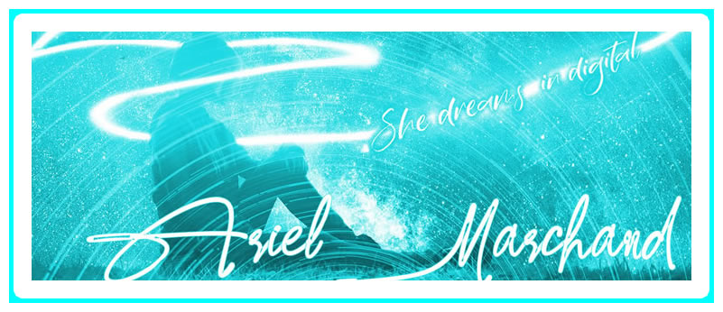

# 02-Advanced-CSS-Portfolio # My First portfolio
## Introduction:

In this activity we made portfolios from scratch to showcase our working skills and talents for potential employers looking to fill a position. Providing a developer's name, a recent photo, and links to sections about myself and my work, and how to contact myself.

We created a static website that you can view on this link:[02-Advanced-CSS-Portfolio # My first portfolio] (https://killjoyangel.github.io/02-Advanced-CSS-Portfolio/
)

Attempted to make lots of commits and pushed to github. 

## Technologies used:
* HTML
* CSS
## Screen shots of wireframe, html and CSS

Also took plenty of notes of my changes in both the html and Css

### Original CSS

### Original HTML

### Portfolio Logo

### Original Portfolio fullpage screenshot

### Updated Portfolio full page screenshot

